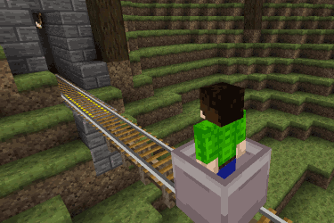

minetest mod Carts (formerly boost_cart)
==========================

Carts and rails (formerly boost_cart)

Information
-----------

This mod is named `carts`, it features work from `boost_cart` mod.
This is improved rail carts mod and featured boots rails..

#### Features

- A fast cart for your railway or roller coaster (up to 7 m/s!)
- Boost and brake rails
- Rail junction switching with the 'right-left' walking keys
- Handbrake with the 'back' key

#### Additions by TenPlus1

- Mesecon detector rail added
- 10 second cart drop when player or item not inside
- Alias' set to replace rails from boost_cart mod

Technical informaton
--------------------

Carts, based almost entirely on the mod boost_cart [1], which
itself is based on (and fully compatible with) the carts mod [2]
and the model was originally designed by stujones11 [3] (CC-0).

This mod can (and maybe must) replace the default carts mod of minetest game.

[1] https://github.com/SmallJoker/boost_cart/
[2] https://github.com/PilzAdam/carts/
[3] https://github.com/stujones11/railcart/

#### Dependencies

* default
* mesecons (optional)

#### nodes

| Name         | node            | notes |
| ------------ | --------------- | ----- |
| Rail         | carts:rail      | to use and travel over rails with carts |
| Bracke rails | carts:brakerail | rail to downgrade velocity of carts |
| Powered rail | carts:powerrail | rail to impulse velocity of a cart |
| Detector rail | carts:detectorrail | it depends on mesecons for detection of mese |

Alias:

| original             | carts alias    |
| -------------------- | -------------- |
| default:rail         | carts:rail     |
| carts:copperrail     | default:rail   |
| boost_cart:copperrail | default:rail  |
| boost_cart:powerrail | carts:powerrail |
| boost_cart:brakerail | carts:brakerail |
| boost_cart:detectorrail | carts:detectorrail |

Licence
------

The model was originally designed by stujones11 [3] (CC-0).

Cart textures are based on original work from PixelBOX by Gambit (permissive
license).

Check [lisence.txt](lisence.txt)
